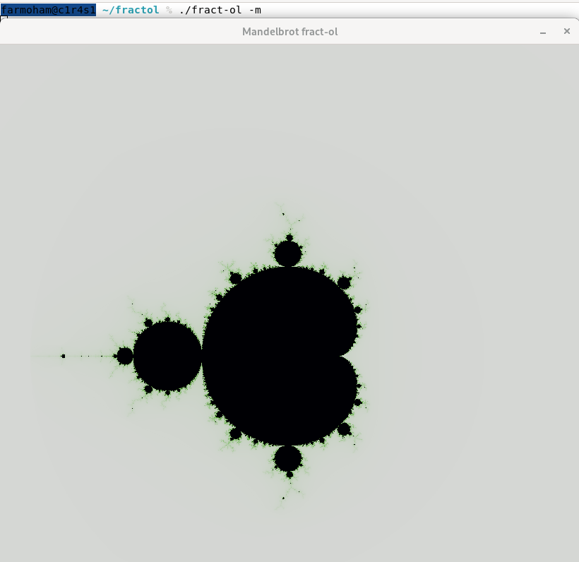
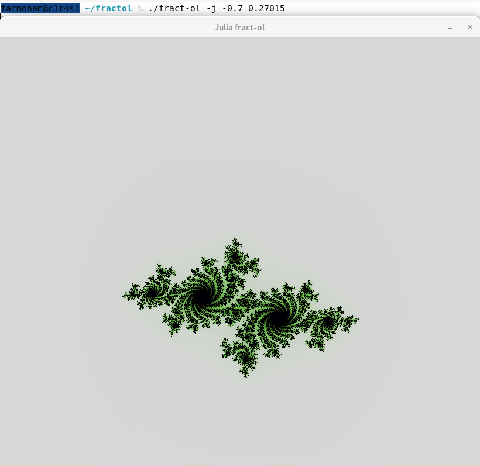
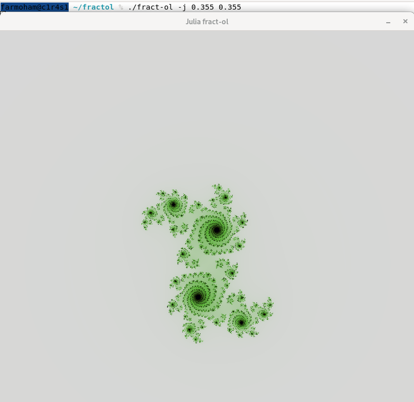

fract-ol is a graphical program that renders fractals such as the Mandelbrot set and the Julia set.
It was developed as part of the 42 curriculum, but it is also a fun project for anyone interested in fractals.

The program uses MiniLibX functions only to create a window and handle basic events.
All the fractal generation, zooming, movement, and coloring are implemented in the program logic.

## Features

-Both Mandelbrot and Julia fractals  
-Smooth zooming (mouse scroll or +/-)  
-Adjustable Julia seeds via command-line arguments  
-Works on both macOS and Linux  


## Installation

1. Clone the repository: ```git clone https://github.com/faresQ7h/fract-ol-42-project.git```
2. Enter the folder: ```cd fract-ol```
3. build using make: ```make```

This will create an executable named ./fract-ol


## Usage

Run the program by specifying which fractal to display:  
  
./fract-ol mandelbrot (-m)  
./fract-ol julia (-j)  
Note: (-m/-j) are easy shortcuts.  
  
Important: Julia must be called with a custom seed following this format: ```./fract-ol -j(julia) <x> <yi>```  
Example: ```./fract-ol julia -0.7 0.27015```  
For Mandelbrot just run: ```./fract-ol -m```  
## Preview  

### Mandelbrot  
  

### Julia  





## Controls

-Mouse scroll -> Zoom in / out  
-(+/-) keys -> Zoom in / out  
-Esc -> Quit  
-Mouse left click -> reset the drawing to the start  


## Compatibility

Linux: Requires X11 development libraries. If missing, install with:```sudo apt install libx11-dev libxext-dev```  
macOS: Uses the system’s MiniLibX, so no extra setup is usually needed.  
